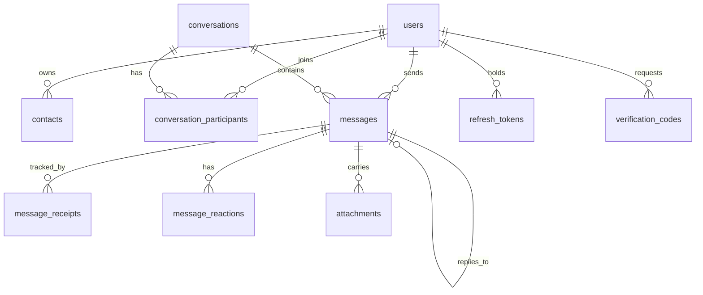

# Signal Clone — Secure Messaging Platform

A functional clone of Signal Desktop: real-time one-to-one and group messaging with
delivery receipts, typing indicators, presence, reactions, replies and disappearing
messages, behind Signal's interface.

Built for the Scaler SDE Fullstack assignment.

| | |
|---|---|
| **Live demo** | https://signal-clone-olive.vercel.app |
| **API** | https://signal-clone-api-cltw.onrender.com · [interactive docs](https://signal-clone-api-cltw.onrender.com/docs) |
| **Repository** | https://github.com/Zoro-1012/signal-clone |

> **Encryption is simulated.** The brief permits this explicitly. Messages are stored
> sealed and never as plaintext, and the sealing layer is real — but the cipher behind it
> is deliberately reversible. See [Simulated encryption](#simulated-encryption).

---

## Try it

The database is seeded, so the app is usable the moment it loads. Sign in with any of
these numbers — including the `+91` country code — and the verification code is always
`123456`.

> The API is on Render's free tier and sleeps after 15 minutes idle. The first request
> after a pause takes roughly 30 seconds while the instance wakes; it is responsive
> immediately afterwards.

| Name | Phone number | Username |
|---|---|---|
| **Nipurn Goyal** *(suggested)* | `+919876543210` | `nipurn` |
| Ananya Sharma | `+919812345678` | `ananya` |
| Rohan Verma | `+919823456789` | `rohan` |
| Meera Iyer | `+919834567890` | `meera` |
| Kabir Nair | `+919845678901` | `kabir` |
| Ishaan Rao | `+919856789012` | `ishaan` |

**To see real-time messaging**, open the app in two browsers (or a normal and a private
window), sign in as Nipurn in one and Ananya in the other, and type. Messages, typing
indicators, receipts and presence all update live.

---

## Running locally

### With Docker (one command)

```bash
docker compose up --build
```

Open http://localhost:3000. The API is on http://localhost:8000, with interactive docs at
http://localhost:8000/docs.

### Without Docker

Two terminals. **Backend** first:

```bash
cd backend
python3 -m venv .venv && source .venv/bin/activate
pip install -e ".[dev]"

cp .env.example .env          # defaults work as-is for local development
alembic upgrade head          # create the schema
python scripts/seed.py        # load the demo data

uvicorn app.main:app --reload --port 8000
```

**Frontend**:

```bash
cd frontend
npm install
cp .env.example .env.local    # points at http://localhost:8000
npm run dev
```

Requires Python 3.10+ and Node 20+.

### Useful commands

```bash
# backend
pytest                        # 87 tests
pytest --cov=app              # with coverage
ruff check app tests          # lint
black app tests               # format
mypy app                      # type check (strict)
python scripts/seed.py --reset  # wipe and re-seed

# frontend
npm run typecheck             # tsc --noEmit
npm run lint
npm run build
```

---

## Tech stack

| Layer | Choice | Why |
|---|---|---|
| Frontend | **Next.js 15** (App Router), TypeScript strict | Required by the brief. App Router for layout-driven UI. |
| Styling | **Tailwind CSS** + CSS custom properties | Theme swap is one class on `<html>`; no component carries `dark:` colour variants. |
| Server state | **TanStack Query** | The WebSocket writes into the same cache the fetches populate, so live and loaded data share one store. |
| Client state | **Zustand** | Theme, drafts, typing and modals — small, synchronous, no provider tree. |
| Backend | **FastAPI** (Python) | Native WebSockets on the same ASGI app as the REST API: one process, one auth path, no broker. |
| ORM | **SQLAlchemy 2.0** async + **Alembic** | Typed models; schema is migration-managed rather than auto-created. |
| Database | **SQLite** | Required by the brief. WAL enabled; the repository layer is dialect-agnostic. |
| Real-time | **Native WebSockets** | No Redis or broker needed at this scale. Scale-out path documented below. |

### Why FastAPI rather than Django

Both were permitted. Real-time is the centre of this assignment, and FastAPI speaks
WebSockets natively on the same app as the REST API — one process, one authentication
path, one deployment unit. Django would need Channels plus a channel layer (Redis in any
real setup), which adds infrastructure for a free-tier demo.

The trade-off is real: no admin, no built-in auth, no ORM batteries. Those are hand-rolled
here, deliberately, and covered by tests.

---

## Architecture

```
┌──────────────┐   REST (writes + reads)    ┌──────────────┐
│              │ ─────────────────────────► │              │
│  Next.js     │                            │   FastAPI    │──► SQLite (WAL)
│  (Vercel)    │ ◄───────────────────────── │   (Render)   │
│              │   WebSocket (delivery)     │              │──► Disk (uploads)
└──────────────┘                            └──────────────┘
```

**Sends go over HTTP, not the socket.** The socket is a delivery channel, not the write
path. Every send therefore has a real status code and natural retry semantics, and the app
degrades to "not live" rather than "broken" when the connection drops.

**Persist, then broadcast — always.** The database is the source of truth; the socket only
accelerates delivery of something already committed. The reverse order would let a
recipient see a message that a failed transaction then rolled back.

### Backend layering

```
app/
├── api/            HTTP + WS routers. Parse, authorise, delegate. No business logic.
├── services/       Business rules. Transaction boundaries live here.
├── repositories/   All SQLAlchemy query construction. The only layer that knows SQL.
├── models/         SQLAlchemy ORM entities.
├── schemas/        Pydantic DTOs. ORM objects never reach the wire.
├── core/           config, security, logging, exceptions, encryption
├── realtime/       connection manager, event protocol, presence
└── db/             engine, session, custom types, migrations, seeds
```

Rules enforced throughout: routers never import repositories; services never import
FastAPI; repositories never import services. Dependencies point strictly inward.

### Frontend layering

```
src/
├── app/            Next.js routes, layouts, providers
├── features/       Vertical slices: auth, conversations, messages, shell
├── components/ui/  Cross-feature primitives (Avatar, Button, Input)
├── lib/            api client, websocket client, formatters, design helpers
├── stores/         Zustand: session, UI/theme
└── styles/         design tokens
```

---

## Database schema

Ten tables, designed by hand and managed with Alembic.



| Table | Purpose | Notable columns |
|---|---|---|
| `users` | Identity and profile | `phone_number` ᵁ, `username` ᵁ, `display_name`, `avatar_color`, `is_online`, `last_seen_at` |
| `verification_codes` | Mocked OTP challenges | `code`, `expires_at`, `consumed_at`, `attempts` |
| `refresh_tokens` | Revocable sessions | `token_hash` ᵁ, `expires_at`, `revoked_at` |
| `contacts` | Directed address-book edges | `owner_id`, `contact_user_id`, unique together |
| `conversations` | Direct and group threads | `type`, `name`, `direct_key` ᵁ, `disappearing_seconds`, `last_message_at` |
| `conversation_participants` | Membership + per-viewer state | `role`, `left_at`, `last_read_message_id`, `is_muted`, `is_pinned` |
| `messages` | Message content | `ciphertext`, `encryption_key_id`, `system_event`, `reply_to_message_id`, `client_message_id`, `expires_at`, `deleted_at` |
| `message_receipts` | Per-recipient delivery state | `delivered_at`, `read_at`, unique per (message, user) |
| `message_reactions` | Emoji reactions | unique per (message, user, emoji) |
| `attachments` | Files and media | `storage_key`, `content_type`, `size_bytes`, `width`, `height` |

### Design decisions worth defending

**Direct and group conversations share one table.** A 1:1 chat is a conversation with
exactly two participants, so one message pipeline, one permission check and one set of
queries serve both — rather than two implementations that drift apart the first time a
feature is added. A canonical sorted `direct_key` with a unique index makes "open a chat
with this person" idempotent at the database level, so two simultaneous taps cannot create
two threads.

**Receipts are rows, not columns.** A `delivered`/`read` flag on `messages` cannot express
"read by three of seven group members". One row per recipient makes group receipts and the
single/double-check UI a direct aggregate.

**Unread state is a read watermark, not a counter.** A counter is denormalised state that
drifts under concurrency. `last_read_message_id` is idempotent — applying it twice is
identical to applying it once — and self-corrects.

**`conversations.last_message_at` is denormalised deliberately.** The conversation list
sorts by it on every load, which would otherwise be a correlated subquery over the whole
message table. It is written inside the same transaction as the message, so it cannot
drift.

**Messages store ciphertext only.** There is no plaintext column. Keeping both would
defeat the sealing layer and make the encryption story dishonest.

**System messages are structured, not pre-rendered.** `system_event` plus a JSON payload
rather than a baked sentence, so wording stays a presentation concern.

**`client_message_id` is unique per sender.** A retried send after a network timeout
becomes a no-op instead of a duplicate message.

**Indexes are pruned.** No `index=True` on UUID primary keys (SQLite already maintains an
implicit index for a non-INTEGER primary key), and no single-column index a composite
already covers as its leftmost prefix. That removed 15 redundant B-trees, each of which
every insert would otherwise have to update.

---

## API

REST under `/api/v1`, WebSocket at `/ws`. Interactive documentation at `/docs`.

### Authentication

| Method | Path | Purpose |
|---|---|---|
| `POST` | `/auth/register` | Create an account, issue an OTP challenge |
| `POST` | `/auth/login` | Request a code for an existing account |
| `POST` | `/auth/verify` | Exchange a code for a session |
| `POST` | `/auth/refresh` | Rotate the refresh token |
| `POST` | `/auth/logout` | Revoke the session |
| `GET` | `/auth/me` | Current account |

### Users and contacts

| Method | Path | Purpose |
|---|---|---|
| `GET` `PATCH` | `/users/me` | Read or update your profile |
| `GET` | `/users/search?q=` | Find people by name, username or number |
| `GET` `POST` | `/contacts` | List or add contacts |
| `DELETE` | `/contacts/{id}` | Remove a contact |

### Conversations

| Method | Path | Purpose |
|---|---|---|
| `GET` | `/conversations?q=` | List, pinned first then most recent |
| `POST` | `/conversations/direct` | Open a 1:1 chat (idempotent) |
| `POST` | `/conversations/group` | Create a group |
| `GET` `PATCH` | `/conversations/{id}` | Read or update a conversation |
| `POST` | `/conversations/{id}/participants` | Add members *(admin)* |
| `DELETE` | `/conversations/{id}/participants/{user}` | Remove a member *(admin)*, or leave |
| `POST` | `/conversations/{id}/read` | Advance the read watermark |
| `POST` | `/conversations/{id}/flags` | Mute or pin, for yourself only |

### Messages

| Method | Path | Purpose |
|---|---|---|
| `GET` | `/conversations/{id}/messages?cursor=&limit=` | Cursor-paginated history |
| `POST` | `/conversations/{id}/messages` | Send |
| `POST` | `/conversations/{id}/delivered` | Acknowledge delivery |
| `POST` | `/conversations/{id}/messages/{id}/read` | Mark read |
| `PATCH` `DELETE` | `/messages/{id}` | Edit or delete |
| `POST` | `/messages/{id}/reactions` | Toggle a reaction |
| `POST` | `/attachments` | Upload a file |

**Conventions.** Cursor pagination, not offset — a transcript grows while it is being
read, so offsets skip or repeat rows. Cursors are opaque base64 (a raw ISO timestamp ends
in `+00:00`, and `+` decodes to a space in a query string). Every error shares one
envelope:

```json
{ "error": { "code": "conversation_not_found", "message": "That conversation does not exist." } }
```

### WebSocket protocol

Connect to `/ws?token=<access_token>`. Every frame is `{ "type": ..., "payload": {...} }`.

| Direction | Event | Payload |
|---|---|---|
| → server | `typing.start` / `typing.stop` | `conversation_id` |
| → server | `ping` | — |
| ← client | `message.new` | full message |
| ← client | `message.updated` / `message.deleted` | message / `message_id` |
| ← client | `message.status` | `message_ids`, `status`, `user_id` |
| ← client | `reaction.added` / `reaction.removed` | `message_id`, `user_id`, `emoji` |
| ← client | `typing.start` / `typing.stop` | `conversation_id`, `user_id` |
| ← client | `presence.update` | `user_id`, `is_online`, `last_seen_at` |

Only ephemeral signals are accepted *from* clients. Anything that writes to the database
goes through REST, so there is exactly one write path with one set of validation and
authorisation rules. Membership is verified on every typing frame — a valid token is
authentication, not authorisation.

---

## Features

### Core (all implemented)

- **Auth** — phone registration, mocked OTP, profile, session persistence, logout
- **Conversations** — sorted list, search, contacts, unread badges, previews, presence
- **1:1 messaging** — real-time delivery, timestamps, receipts, typing, status lifecycle
- **Groups** — creation, membership, admin add/remove, persisted system events
- **Groups** — member list with roles and presence, admin add/remove, leave group
- **Signal experience** — three-pane shell, bubbles with grouping, date dividers, modals,
  toasts, empty states, placeholder surfaces

### Bonus

| Feature | Status |
|---|---|
| Message reactions | Implemented |
| Reply / quoted messages | Implemented |
| Dark mode | Implemented (default, with light toggle) |
| Responsive layout | Implemented (desktop → tablet → mobile) |
| Attachments | Backend complete (upload, storage interface, traversal-safe); upload UI not wired |
| Disappearing messages | Backend complete, with a background expiry sweeper; no UI control |
| Keyboard shortcuts | Enter to send, Shift+Enter for newline |

### Placeholders

Voice and video calls, Stories, and Linked devices are designed "Coming Soon" surfaces —
which the brief explicitly permits. They are styled rather than blank, because an
unstyled gap reads as an unfinished feature whereas a designed one reads as a scoped
decision.

---

## Security

Tested, with 14 dedicated tests asserting properties that would otherwise be quietly
exploitable:

- **Sessions.** Short-lived JWT access tokens plus opaque, database-backed refresh tokens
  stored only as SHA-256 digests. Refresh rotates; replaying a rotated token is treated as
  theft and revokes every session for the account.
- **No phone-number disclosure.** A number is a login identifier; only your own profile
  returns yours.
- **No existence probing.** A conversation you may not see and one that does not exist
  return byte-identical 404s.
- **Path traversal.** Attachment keys arrive from URLs, so traversal is checked, not
  assumed. Stored filenames are generated — an uploaded filename is attacker-controlled
  and never reaches the filesystem.
- **Attachment ownership.** An upload already claimed by one message cannot be re-attached
  by another user.
- **Production guards.** Boot refuses a placeholder or under-32-byte JWT signing key
  (RFC 7518 requires an HMAC key at least the hash length; PyJWT only warns).

### Simulated encryption

Real end-to-end encryption is out of scope, as the brief allows. Rather than ignore it,
messages pass through an `EncryptionEnvelope` abstraction and are stored sealed, with the
key id and algorithm recorded on every row.

The cipher behind it (`MockCipher`) is base64 — chosen precisely because nobody can
mistake it for a security control. What is real is the *shape*: there is no plaintext
column, the call sites are where real crypto would go, and swapping in a real
implementation is a one-class change.

**This app does not protect message contents.** Treat it as a demonstration of
architecture, not of security.

---

## Testing

```bash
cd backend && pytest        # 87 tests
```

| Area | Coverage |
|---|---|
| Auth | Normalisation, duplicates, attempt limiting, rotation, reuse detection, logout |
| Conversations | Idempotent creation, per-viewer projection, admin rules, last-admin promotion |
| Messages | Sealed storage, retry idempotency, group receipt semantics, cursor stability |
| Real-time | Socket auth, live delivery, group fan-out, typing isolation, presence |
| Security | Disclosure, authorisation boundaries, traversal, token storage |

Notable: real-time tests drive an actual WebSocket and assert a message sent by one user
arrives on another's connection. The frame helper sends a ping and reads until the pong,
rather than reading a fixed count — `receive_json` blocks forever, so a fixed count hangs
the suite in exactly the case a negative test needs.

CI runs ruff, black, mypy `--strict`, pytest, and a migration up/down/up round trip on
every push, plus eslint, `tsc` and a production build for the frontend.

---

## Deployment

**Backend → Render.** The repository contains `render.yaml`; point Render at it and the
service and its environment are provisioned in one step.

Render's free tier provides no persistent disk, so migrations and seeding run at **boot**
rather than at build. Both are idempotent — Alembic is a no-op once at head, and the
seeder detects existing data and stops — so this costs nothing when state survives and
rebuilds the demo when it does not. The practical consequence is that messages sent by a
visitor are lost when the instance restarts, and the seeded demo data returns. A paid disk
or a managed Postgres would remove that; neither is necessary for a demo.

**Frontend → Vercel.** Import the repository, set the root directory to `frontend`, and
add `NEXT_PUBLIC_API_URL` and `NEXT_PUBLIC_WS_URL` pointing at the Render service.

Afterwards, set `CORS_ORIGINS` on Render to the Vercel URL. Credentialed CORS forbids a
wildcard, so it must be the real origin.

---

## Assumptions and limitations

Stated plainly, so they read as decisions rather than gaps.

0. **Deployed state is ephemeral.** Render's free tier has no persistent disk, so the
   SQLite file does not survive an instance restart. The service re-migrates and re-seeds
   on boot, so the demo is always usable, but messages a visitor sends are not permanent.
1. **Encryption is simulated.** The envelope is real; the cipher is not.
2. **OTP is a fixed code** (`123456`), enabled by the `MOCK_VERIFICATION` flag, because
   there is no SMS provider. Rate limiting, expiry, attempt limits and single-use
   consumption are all still enforced, so the flow exercises the same paths a real
   provider would. Turning the flag off restores random codes — which is the same change
   that would wire up a provider.
3. **SQLite is the production database**, as mandated, with WAL enabled. The repository
   layer is dialect-agnostic; Postgres would be a connection-string change.
4. **Single backend process.** Presence, typing and the connection registry are in-memory,
   which is correct at this scale. Horizontal scaling needs the `ConnectionManager` swapped
   for a Redis pub/sub implementation — the interface is already shaped for it, and the
   Dockerfile pins one worker for exactly this reason.
5. **The WebSocket token travels as a query parameter**, because the browser WebSocket API
   cannot set headers. Query strings are likelier to be logged than headers; mitigated by
   the access token being short-lived and refresh tokens never travelling this way.
6. **Rate limiting covers OTP attempts only.** Adequate for a demo, not for production.
7. **Message search decrypts in Python** and is therefore bounded rather than indexed —
   the honest cost of storing ciphertext.
8. **Signal's visual language is reconstructed** from its published design. No Signal code,
   assets or trademarks are vendored.

---

## Attribution

Signal is a trademark of Signal Messenger, LLC. This project is an independent educational
clone built for an assignment, is not affiliated with or endorsed by Signal, and contains
no Signal source code or assets.
